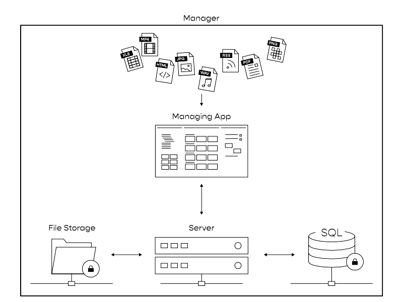

# Session Manager

Der *Session Manager* ist eines der Kernelemente von UNIQVUE. Dieser ist die Managing-App und bildet das Authoring-Tool mit dem sie ihre Show und den gesamten Showroom individualisieren können. Hier werden Sessions angelegt, Toolboxes für einen dynamischen Workflow konzipiert und der Style bzw. das gesamte Erscheinungsbild ihres Showrooms eingestellt. Der Session Manager arbeitet unabhängig vom Showroom und kommuniziert mit dem Server, wo Content für ihre Show organisiert bzw. bereitgestellt wird. 

Alles Weitere zum Umgang mit dem Manager wird in den folgenden Kapiteln erklärt.

