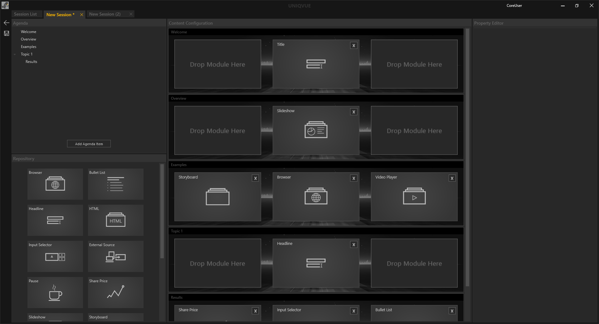

# Sessions 

Wie zuvor schon erwähnt sind Sessions die Kernelemente einer jeden Präsentation über den *Showroom*. In einer *Session* ist zum Einen ihre *Agenda*, also Struktur ihrer Präsentation und zum Anderen das gesamte Erscheinungsbild und die Funktionalität des *Showrooms* definiert. In Kapitel [Dashboard](dashboard.md) gibt es dazu einen Überblick. 

Hier finden sie einen allgemeinen Überblick zu *Sessions*.

*Die Session List* 

 

Das *Session List* Fenster unterteilt sich in drei Bereiche, die zur besseren Übersicht farbig umrandet sind. Ganz Links befinden sich die allgemeinen [Bedienelemente](bedienelemente.md). In der Mitte befindet sich das Hauptfenster mit der Listen Ansicht der Sessions. Rechts daneben befindet sich der *Session Inspector*.
Am oberen rechten Rand befindet sich ein Suchfeld, über das eine Session gesucht werden kann. Die Eingabe ist sensitiv und filtert dynamisch die Listen entsprechend ihrer Eingabe. 

Die eigentliche Liste der *Sessions* ist in mehrere Spalten unterteilt. Jede Spalte repräsentiert dabei eine allgemeine Eigenschaft einer *Session*. *Sessions* können durch Klicken auf die jeweilige Eigenschaft in der Kopfzeile der Liste sortiert werden.  

***
**Name** - Name der *Session*. Durch Doppelklick kann dieser geändert werden.

***
**Category** - Hier können sie ihrer *Session* eine Kategorie vergeben. Die Kategorien finden sich als Ordner im Dashboard des [Showrooms](showroom.md) wieder, in denen die Sessions dann verfügbar sind.
***
**Date** - Beim Erstellen einer *Session* wird automatisch das aktuelle Datum vergeben. Das hilft die Sessions nach Datum zu sortieren und wiederzufinden
***
**Author** - Hier können sich die AutorInnen der *Session* eintragen, um so später nach ihren *Session* filtern zu können.  
***
**Session Type** - Eine *Session* kann einem bestimmten Typ angehören wie Workshop oder Präsentation. Haben sie einen Typ vergeben ist es einfach alle Workshops zu filtern und anzeigen zu lassen.

***
**Released** - Durch setzen eines Hakens wird die *Session* im [Showroom](showroom.md) verfügbar gemacht.

***
**Preload** - Ist Preload aktiv wird die Session vorgeladen. So werden Ladezeiten beim Öffnen der Session im Showroom verkürzt. Es kann nur eine Session vorgeladen werden. 

***
**Toolbox (DISC)** - Hier kann eine *Toolbox* aus der *Toolbox Liste* ausgewählt werden. In Kapitel [Toolbox](toolbox.md) gibt es detaillierte Informationen dazu.
***

**Style** - Hier kann ein *Style* aus der *Style Liste* zugewiesen werden. Was genau ein Style ist, wird in Kapitel [Styles](styles.md) detailliert erläutert.

***
**Default Background** - Ein einheitlicher 3D-Hintergund bzw. Thema kann hier aus einer Auswahl für die gesamte *Session* gesetzt werden. Alle Elemente in der Agenda werden diesen Hintergrund vorerst verwenden. Falls sie verschiedene Hintergründe in einer *Session* wünschen, können Sie dies in der *Session* selbst definieren.  

**Default Light** - Hier kann die Lichtfarbe für die gesamte *Session* gesetzt werden. Sollten Sie sich verschiedene Lichtfarben in einer Session wünschen, können sie dies in der Session selbst definieren.  
***
Der *Session Inspector* auf der rechten Seite stellt noch einmal die wichtigsten Eigenschaften einer ausgewählten *Session* bereit. Außerdem gibt es an dieser Stelle die Möglichkeit Notizen zur jeweiligen *Session* zu machen. 
***

**Session Description:** - Notiz zur *Session* 

***

Mit dem ‘Edit Session’ Button gelangt man in die Bearbeitungsebene der *Session*, dem *Session Editor*. Dieser besteht aus mehreren Bereichen:

***

Der *Session Editor*

* **Agenda:** Dieser zeigt die Struktur der Agenda als hierarchischen Baum.
</li>  

* **Repository:** Enthält alle verfügbaren Module wie Slideshows etc.
</li>

* **Content Configuration:** Repräsentiert die Platzierung von Modulen auf dem Display Setup

* **Property Editor:** Hier werden die Eigenschaften der Module wie sie in Kapitel [Module](module.md) erläutert werden gezeigt. Darüber hinaus  werden auch die Eigenschaften der übergeordneten Agenda gezeigt. Einzelne Agendapunkte können individuelle Eigenschfaften besitzen. 

Einen detaillierten Einstieg in den Workflow des *Session Editors* gibt es in Kapitel [Session Worfklow](sessionworkflow.md). 
