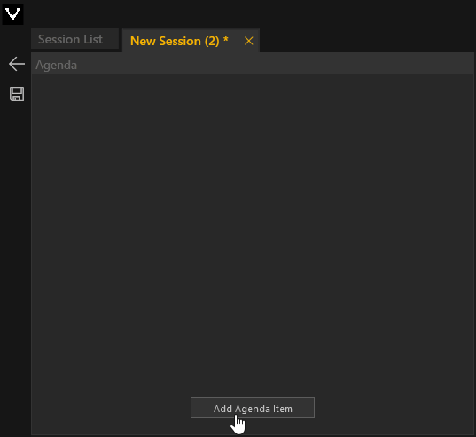
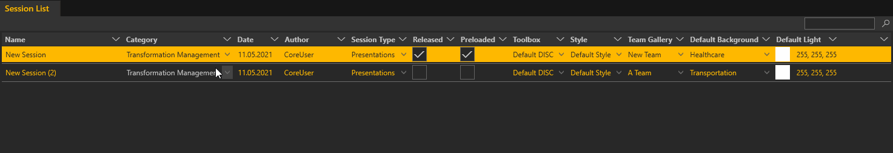

# Session Workflow

<!---

--->
Mit den konsistenten Bedienelementen, die sich rechts außen am Dokumentenfenster befinden, kann einfach eine Session bearbeitet, erstellet, duplizieret oder gelöscht werden. 

Zur Erinnerung noch einmal die Icons und ihre Funktion: 
<ul>
<li>Der Pfeil der nach links zeigt, führt zurück in das Menü von dem aus man gestartet ist. 
</li>

<li>Der Stift ist das Symbol, um eine ausgewählte Session zu bearbeiten. 
</li>

<li>Das Dokument mit dem Pluszeichen ist zum Erstellen einer neuen Session. 
</li>

<li>Der Dokumentenstapel darunter ist zum Duplizieren einer ausgewählten Session. 
</li>

<li>Mit dem Mülleimersymbol löscht man eine ausgewählte Session. 
</li>
</ul>
***
**Erstellen einer neuen Session:**  

<video width="99%" height="220" autoplay loop muted markdown="1">
    <source src="../img/Manager/Gifs/SessionList_Workflow.webm" type="video/webm" markdown="1">
</video>

Sie erstellen eine neue *Session* durch Klicken auf das Dokument mit dem Pluszeichen. Mit Doppelklick auf den Namen können Sie der *Session* einen Namen geben. Diese *Session* ist zunächst leer. Sie enthält außer einem Default *Style* und einer Default *Toolbox* keine weiteren Inhalte. Das können Sie ändern, indem Sie auf den Stift zum Bearbeiten der *Session* klicken. Alternativ kann die *Session*, ganz rechts im Inspektor, durch Klicken auf ‘Edit Session’ bearbeitet werden. Beide Vorgänge leiten weiter zum *Session Editor*. Dieser wird als neuer Tab erzeugt, welcher den Namen der aktuell zu bearbeitenden *Session* trägt. Beliebig viele Tabs also *Sessions* können gleichzeitig geöffnet sein. Das Sternsymbol (‘\*’) erscheint außerdem im *Session* Namen, um einen Indikator dafür zu liefern, ob eine *Session* noch ungespeicherte Änderungen enthält.
***
<!---
 
--->

***

Zur Erinnerung - Der *Session Editor* besteht aus vier Bereichen: 
<ul>
<li>Agenda: Dieser zeigt die Struktur der Agenda als hierarchischen Baum.
</li>  

<li>Repository: Enthält alle verfügbaren Module wie Slideshows etc.
</li>

 

<li>Content Configuration: Repräsentiert die Platzierung von Modulen auf dem Display Setup
</li>

<li>Property Editor: Hier werden die Eigenschaften der Module wie Sie in Kapitel [Module](module.md) erläutert werden gezeigt. Darüber hinaus werden auch die Eigenschaften der übergeordneten Agenda gezeigt. Einzelne Agendapunkte können individuelle Eigenschfaften besitzen. Dazu zählen:
<ol>
<li><b>Light Color:</b> Setzt die Lichtfarbe in ihrem Raum.</li>
<li><b>Sound:</b> Hier können Sie einen Sound auswählen, der abgespielt wird beim ereichen des Agendapunktes</li>
<li><b>Panorama:</b> Alternativ zum 3D-Hintergrund können Sie hier auch große Panoramen als Hintergrund auswählen.
</li>
<li><b>Background:</b> Alternativ zum 'Default' Hintergrund, können Sie hier aus einer Auswahl anderer 3D-Hintergründe auswählen und explizit für diesen Agendapunkt festlegen </li>
</ol>

</li>  

</ul>
***

**Eine Agenda Anlegen:** 

Im *Agenda Tree* füllen Sie nun ihre *Agenda* mit Punkten. Um einen neuen Punkt in der Hierarchie zu erstellen, drücken Sie den Button ‘Add Agenda Item’. Durch Doppelklick auf den Namen des neu erstellten Agenda-Punktes, kann dieser geändert werden. Im *Agenda Item Editor* erscheint nun ein neues Element, welches das Display Setup des *Showrooms* repräsentiert. Unter einem Agenda-Punkt können Sie zudem weitere Agenda-Unterpunkte erzeugen. In der Hierarchie der *Agenda* werden Unterpunkte eingerückt dargestellt.  
***
**Die Agenda mit Modulen füllen:**  
<!---

--->
<video width="99%" height="540" autoplay loop muted markdown="1">
    <source src="../img/Manager/Gifs/Agenda_Anlegen.webm" type="video/webm" markdown="1" align="left">
</video>

Ziehen Sie aus dem *Agenda Repository* Module ihrer Wahl per Drag and Drop in ein Element im *Agenda Item Editor*. Entsprechend des Display Setups können Module innerhalb des Elements platziert werden. So können mehrere Module auf verschiedene Displays verteilt sein. Füllen Sie so ihre gesamte *Agenda*. 
***
<!---

--->

<video width="99%" height="540" autoplay loop muted markdown="1">
    <source src="../img/Manager/Gifs/Agenda_Fuellen.webm" type="video/webm" markdown="1" align="left">
</video>

**Module mit Inhalten füllen:** 

Klicken Sie auf ein Modul innerhalb des *Agenda Item Editor*. Der *Property Editor* am rechten Rand zeigt ihnen entsprechend des Moduls dessen Eigenschaften an. In Kapitel **Modul** sind alle Eigenschaften jedes Moduls detailliert erläutert. Durch Klicken auf eine Eigenschaft öffnet sich der *Asset Browser*. Importieren Sie Bilder, HMTL-Dateien, Videos und viele andere Inhalte und wählen Sie diese aus. Wie der *Asset Browser* genauer funktioniert, lesen Sie in Kapitel **Asset Browser**. 
***

**Speichern:**

Ist die *Agenda* nach ihren Wünschen gefüllt muss diese gespeichert werden. Wie erwähnt zeigt das Sternsymbol im Tab (‘\*’) an, ob es ungespeicherte Änderungen gibt. Durch klicken auf das Diskettensymbol oder Drücken der Tastenkombination `STRG + S` wird die *Agenda* gespeichert. 
***
**Eine Toolbox, einen Style und ein Team der Session zuweisen:** 
<!---

--->
<video width="99%" height="180" autoplay loop muted markdown="1">
    <source src="../img/Manager/Gifs/Release_Session.webm" type="video/webm" markdown="1" align="left">
</video>

Nach dem Speichern navigieren Sie zurück in die *Session Liste*. Der Listeneintrag einer jeden *Session* enthält die Spalte ‘Toolbox’, ‘Style’ und 'Team'. Die Standardauswahl ist immer ‘Default Style’ und ‘Default Toolbox’. 'Team' ist per Default nicht zugewiesen. Durch Klicken auf diese, können Sie aus einer Liste von *Styles*,*Toolboxes* und *Teams* auswählen, die Sie zuvor erstellt haben. In den Kapiteln [Toolbox Workflow](toolboxworkflow.md),  [Style Workflow](styleworkflow.md) und [Team Gallery](teamgallery.md) gibt es detaillierte Beschreibungen dazu. 
***

**Sessions organisieren und freigeben:** 

Vergeben Sie in der Spalte ‘Category’ ihrer *Session* eine Kategorie. Durch Setzen des Hakens bei ‘Released’ wird die *Session* im *Showroom Dashboard* innerhalb eines Ordners, der den Namen der Kategorie trägt, verfügbar gemacht. In Kapitel [Showroom](showroom.md) wird u.a. erläutert, wie Sie *Sessions* laden können.

***
**Tipps und Tricks:**

Sie können ganz klassisch Agenda Module oder ein Listenelement aus der Agendahierarchie mit den Tastenkombinationen `STRG + C` und `STRG + V` in den Zwischenspeicher kopieren und wieder einfügen.
