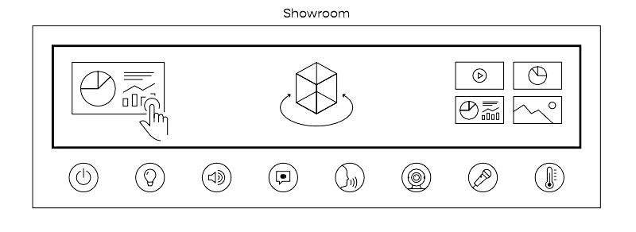

# Showroom Übersicht

Der Showroom ist neben dem Manager der zentrale Bestandteil von UNIQVUE. Hierüber werden die zuvor angelegten Sessions geladen und entfalten ausgebreitet auf Ihrem Displaysetup ihren immersiven Charakter. In jeder Phase ihrer Präsentation haben Sie hier die Möglichkeit inhaltlich und darüber hinaus dynamisch auf verschiedene Situationen zu reagieren. Durch Toucheingaben auf den Displays können Sie intuitiv und schnell alle Funktionen des Showrooms erreichen und einzelne Module steuern.  

In den folgenden Kapiteln werden die einzenen Elemente und Workflows des User Interfaces erläutert und wie Sie diese optimal bedienen können.    

