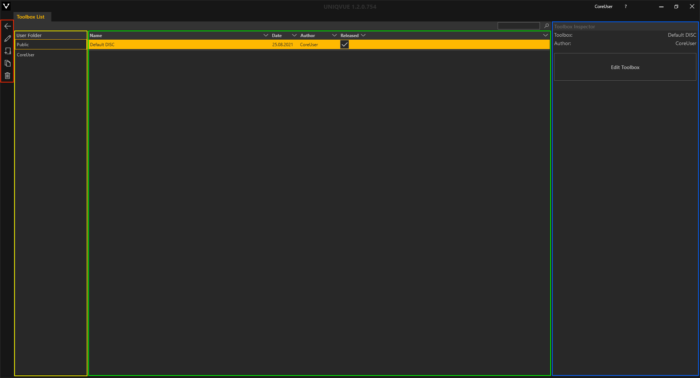
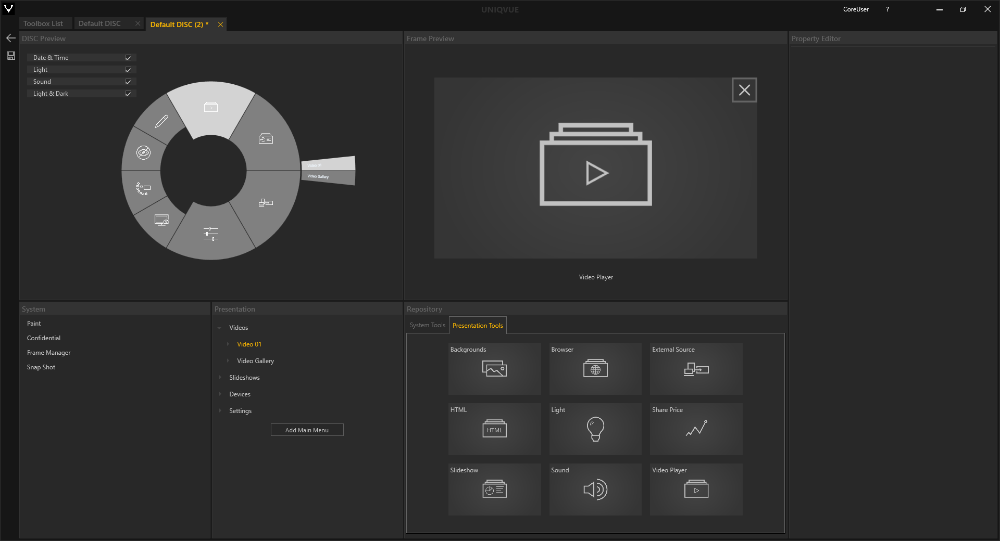

# Toolboxes 

Eine *Toolbox* oder auch *DISC* ist für jede Session obligatorisch. Das heißt, sie muss zwingend einer *Session* zugewiesen sein. Die *Toolbox* ist das zentrale Bedienungswerkzeug und ist in jeder Phase in der Arbeit mit dem Showrooms zugänglich. Sie können die *Toolbox* individuell an ihren Workflow aus einem Repertoire an Funktionen und nützlichen Tools anpassen. 
 
Hier finden sie einen allgemeinen Überblick zu *Toolboxes*.
 
Die *Toolbox List*

 

Das *Toolbox List* Fenster unterteilt sich in vier Bereiche. Hier zur besseren Übersicht farbig umrandet. Ganz Links befinden sich die allgemeinen Bedienelemente.
Daneben befindet sich eine Übersicht der öffentlichen und benutzerspezifischen Verzeichnisse. Das öffentliche Verzeichniss ist für alle NutzerInnen des Computers einsehbar, wie bspw. Gastkonten. Das benutzerspezifische Verzeichnis ist nur für angemeldete NutzerInnen einsehbar. Das Hauptfenster ist die Listenansicht der *Toolboxes*. Rechts daneben befindet sich der *Toolbox Inspector*. 

Die *Toolbox List* ist in mehrere Spalten unterteilt. Jede Spalte repräsentiert dabei eine allgemeine Eigenschaft der *Toolbox*. *Toolboxes* können durch Klicken auf die jeweilige Eigenschaft in der Kopfzeile der Liste sortiert werden. 

 

1.    **Name** - Name der *Toolbox*. Durch Doppelklick kann dieser geändert werden. 

 

2.    **Date** - Beim Erstellen einer *Toolbox* wird automatisch das aktuelle Datum vergeben. Das hilft die *Toolboxes* nach Datum zu sortieren und wiederzufinden. 

 

3.    **Author** - Automatisch wird hier die Person mit ihrem Username eingetragen. 

 

4.    **Released** - *Toolboxes*, die mit einem Haken bei ‘Released’ markiert sind, werden in der *Session List* zur Auswahl verfügbar gemacht. In Kapitel [Sessions](sessions.md) wird dies unter *Session List* genauer erläutert.  

Initial befindet sich in der *Toolbox List* der Eintrag ‘Default DISC’ mit voreingestellten Funktionen.  

Der *Toolbox Inspector* auf der rechten Seite zeigt nochmal wichtige Eigenschaften im Überblick. 

Mit dem ‘Edit Toolbox’ Button gelangt man in die Bearbeitungsebene der *Toolbox*, dem ‘Toolbox Editor’. 

Der *Toolbox Editor*

Der *Toolbox Editor* ist in mehrere Bereiche eingeteilt: 

* **Toolbox Preview:**

    Dieser zeigt eine Übersicht der *Toolbox* als grafische Repräsentation.

* **Presentation und System:**

    Dieser Bereich strukturiert die Funktionen der *Toolbox* in einer Hierarchie, die sie selbst erstellen können. Unabhängig von der Agenda können hier verschiedene Module dynamisch in Ihre Show über die *Toolbox* verfügbar gemacht werden.

* **Repository:**

    Unter ‘Presentation Tools’ befindet sich eine Auswahl von Modulen wie sie in Kapitel [Modul](module.md) detailliert erläutert werden. Darüber hinaus beinhaltet ‘System Tools’ ein paar sehr hilfreiche Funktionen für ihre Show: 

    -  **Confidential:** 

        Verschleiert die Inhalte des gesamten Showrooms. Solange der Button aktiv ist sind keine Inhalte erkennbar. Dieser lässt sich dauerhaft einrasten. Durch Eingabe einer von Ihnen definierten Pin werden dann die Inhalte wieder freigegeben.</li>

    - **Frame Manager:**

        Hiermit können offene Module schnell und einfach verteilt und angeordnet werden.

    - **Snap Shot:** 

        Erzeugt einen Screenshot des gesamten Showrooms.

    - **Paint:**
        Freies Zeichnen auf dem Displaysetup. Verschiedene Farben stehen zur Auswahl. Außerdem kann die Pinselgröße eingestellt werden.

* **Frame Preview:**

    Dieser Bereich visualisiert die Ansicht des entsprechenden Fensters. Wenn mehrere Inhalte einem Fenster zugeordent wurden, erstellt UNIQVUE automatisch eine Galerie daraus. Für jedes Asset kann in den Eigenschaften ein Thumbnail festgelegt werden, welches dann im Showroom angezeigt wird.

* **Property Editor:**

    Hier werden spezifische Eigenschaften angezeigt und Inhalte von Modulen zugewiesen. Der *Asset Browser* macht die entsprechenden Inhalte verfügbar. In Kapitel [Asset Browser](assetbrowser.md) findet sich eine detaillierte Erläuterung dazu.

Einen detaillierten Einstieg zum Umgang mit dem *Toolbox Editor* gibt es in Kapitel [Toolbox Worfklow](toolboxworkflow.md). 

