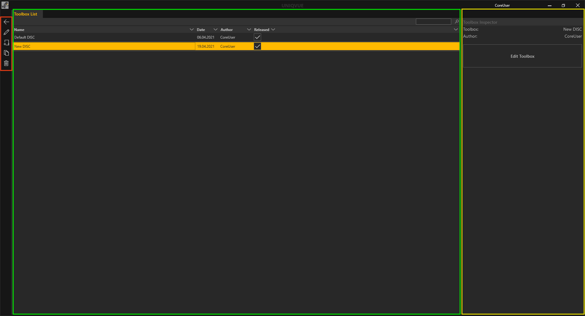

# Toolboxes 

 
 

 

 
 

Die Toolbox Liste 

 
Das *Toolbox List* Fenster unterteilt sich in drei Bereiche. Hier zur besseren übersicht farbig umrandet. Ganz Links befinden sich die allgemeinen Bedienelemente. In der Mitte befindet sich das Hauptfenster mit der Listenansicht der *Toolboxes*. Rechts daneben befindet sich der *Toolbox Inspector*. 

Die *Toolbox List* ist in mehrere Spalten unterteilt. Jede Spalte repräsentiert dabei eine allgemeine Eigenschaft der *Toolbox*. *Toolboxes* können durch Klicken auf die jeweilige Eigenschaft in der Kopfzeile der Liste sortiert werden. 

 

1.    **Name** - Name der Toolbox. Durch Doppelklick kann dieser geändert werden. 

 

2.    **Date** - Beim Erstellen einer Toolbox wird automatisch das aktuelle Datum vergeben. Das hilft die Toolboxes nach Datum zu sortieren und wiederzufinden. 

 

3.    **Author** - Automatisch wird hier die Person mit ihrem Username eingetragen. 

 

4.    **Released** - Toolboxes, die mit einem Haken bei ‘Released’ markiert sind, werden in der *Session Liste* zur Auswahl verfügbar gemacht. In Kapitel [Sessions](sessions.md) wird dies unter *Session Liste* genauer erläutert.  

Initial befindet sich in der *Toolbox Liste* der Eintrag ‘Default DISC’ mit voreingestellten Funktionen.  

Der Toolbox Inspector auf der rechten Seite zeigt nochmal wichtige Eigenschaften im Überblick. 

Mit dem ‘Edit Toolbox’ Button gelangt man in die Bearbeitungsebene der Toolbox, dem ‘Toolbox Editor’. Einen detaillierten Einstieg zum Toolbox Editor gibt es in Kapitel *Toolbox Worfklow*. 

