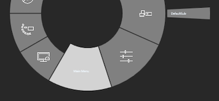
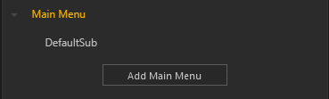

# Toolbox Workflow 

  
 
***
Mit den konsistenten Bedienelementen, die sich rechts außen am Dokumentenfenster befinden, kann man einfach eine Toolbox bearbeiten, erstellen, duplizieren oder löschen. 

Zur Erinnerung noch einmal Icons und ihre Funktion: 
<ul>
<li>Der Pfeil der nach links zeigt, führt zurück in das Menü von dem aus man gestartet ist. 
</li>

<li>Der Stift ist das Symbol, um eine ausgewählte Toolbox zu bearbeiten. 
</li>

<li>Das Dokument mit dem Pluszeichen ist zum Erstellen einer neuen Toolbox. 
</li>

<li>Der Dokumentenstapel darunter ist zum Duplizieren einer ausgewählten Toolbox. 
</li>

<li>Mit dem Mülleimersymbol löscht man eine ausgewählte Toolbox. 
</li>
</ul>
***

 

**Erstellen einer neuen Toolbox:**  

Sie erstellen eine neue Toolbox durch Klicken auf das Dokument mit dem Pluszeichen. Mit Doppelklick auf den Namen können Sie diesen ändern. Durch Klicken auf das Stiftsymbol oder durch Klicken auf den ‘Edit Toolbox’ Button gelangen Sie zum Toolbox Editor. Dieser öffnet sich in einem neuen Tab mit dem Namen der zu bearbeitenden Toolbox. Beliebig viele Tabs also Toolboxes können gleichzeitig geöffnet sein. Das Sternsymbol (‘*’) erscheint außerdem im Toolbox Namen, um einen Indikator dafür zu liefern, ob eine Toolbox noch ungespeicherte Änderungen enthält. Zu sehen ist jetzt eine Repräsentation der Toolbox mit einigen voreingestellten Funktionen. Die Konfiguration ihrer Toolbox können Sie hier jetzt anpassen. 
 ***
Zur Erinnerung - Der *Toolbox Editor* ist in mehrere Bereiche eingeteilt: 

* **Toolbox Preview:**

    Dieser zeigt eine Übersicht der Toolbox als grafische Repräsentation.

* **Presentation und System:**

    Dieser Bereich strukturiert die Funktionen der Toolbox in einer Hierarchie, die Sie selbst erstellen können. Unabhängig von der Agenda können hier verschiedene Module dynamisch in ihre Show über die Toolbox verfügbar gemacht werden.

* **Repository:**

    Unter ‘Presentation Tools’ befindet sich eine Auswahl von Modulen wie sie in Kapitel [Modul](module.md) detailliert erläutert werden. Darüber hinaus beinhaltet ‘System Tools’ ein paar sehr hilfreiche Funktionen für ihre Show: 

    -  **Confidential:** 

        Verschleiert die Inhalte des gesamten Showrooms. Solange der Button aktiv ist sind keine Inhalte erkennbar. Durch Eingabe einer Pin werden diese wieder freigegeben.</li>

    - **Frame Manager:**

        Hiermit können offene Module schnell und einfach verteilt und angeordnet werden.

    - **Snap Shot:** 

        Erzeugt einen Screenshot des gesamten Showrooms.

    - **Paint:**
        Freies zeichnen auf dem Displaysetup. Verschiedene Farben stehen zur Auswahl. Außerdem kann die Pinselgröße eingestellt werden.

* **Frame Preview:**

    Dieser Bereich visualisiert die Ansicht des entsprechenden Fensters. Wenn mehrere Inhalte einem Fenster zugeordent wurden, erstellt UNIQVUE automatisch eine Gallery daraus. Für jedes Asset kann in den Eigenschaften ein Thumbnail festgelegt warden, welches im dann Showroom angezeigt wird.

* **Property Editor:**

    Hier werden spezifische Eigenschaften angezeigt und Inhalte von Modulen zugewiesen. Der *Asset Browser* macht die entsprechenden Inhalte verfügbar. In Kapitel [Asset Browser](assetbrowser.md) findet sich eine detaillierte Erläuterung dazu.

***

**Eine Toolbox anpassen:** 

Im Bereich ‘Presentation’ klicken Sie nun auf den Button ‘Add Main Menu’ um eine neue Schaltfläche als Hauptmenu in ihrer Toolbox zu erzeugen. In der Hierarchie erscheint ebenfalls ein neues Element mit dem Namen ‘Main Menu’ und einem leeren Unterelement ‘Default Sub’.

Wählen Sie das leere Element aus. Ziehen Sie nun per Drag and Drop aus dem Bereich ‘Presentation Tools’ ein Modul ihrer Wahl über den Bereich ‘Frame Preview’ und platzieren Sie es.

**Inhalte verknüpfen:** 

Das platzierte Modul ist nun mit Inhalten zu verknüpfen. Klicken Sie auf das Modul in der ‘Frame View’. Der ‘Property Editor’ zeigt nun alle einstellbaren Eigenschaften dieses Moduls an. Inhalte wie Bilder, Videos usw. werden durch den *Asset Browser* verfügbar gemacht. Durch Klicken auf die Schaltfläche ‘Browse’ öffnet sich dieser. In Kapitel *Asset Browser* gibt es eine detaillierte Erklärung wie dieser funktioniert. 

**Menus benennen:** 

Nachdem Sie ihre Menus mit Modulen und Inhalt gefüllt haben, sollten Sie diese Sinnvoll benennen. Durch Doppelklick auf den Namen eines Elementes in der Hierarchie, können Sie ihren Menüs und Untermenüs Namen vergeben und so sinnvoll strukturieren.  

**Speichern:** 

Ist die Toolbox nach ihren Wünschen angepasst muss diese gespeichert werden. Das Sternsymbol im Tab (‘*’) zeigt Ihnen an, ob es ungespeicherte Änderungen gibt. Durch klicken auf das Diskettensymbol oder Drücken der Tastenkombination STRG + S wird die Toolbox gespeichert.  

**Toolbox freigeben:** 

Nach dem Sie gespeichert haben, navigieren Sie zurück in die Toolbox List und ändern Sie den Namen der Toolbox durch Doppelklick auf den Namen des Listeneintrags. Der Listeneintrag einer jeden Toolbox enthält die Spalte ‘Released’. Durch setzen des Hakens wird die Toolbox nun der Liste der verfügbaren Toolboxes angefügt und somit zur Zuweisung zu einer Session freigegeben. In Kapitel *Session Workflow* wird das genauer erklärt.  

